# 업비트 수집 DB ERD 분석

Date: 2026-06-17
Source DB Contract: `docs/contracts/db/schema.sql`
Related Architecture: `docs/02_Architecture/upbit-collection-pipeline.md`

## 목적

이 문서는 `docs/contracts/db/schema.sql`을 읽기 쉽게 보기 위한 파생 분석 문서다. DB 스키마(schema)의 단일 기준(source of truth)은 `docs/contracts/db/schema.sql`이며, 이 문서는 Mermaid ERD(Entity Relationship Diagram)와 짧은 설명으로 테이블 관계를 빠르게 파악하는 데 사용한다.

## ERD

```mermaid
erDiagram
  instruments {
    BIGINT id PK
    TEXT exchange UK
    TEXT market_code UK
    TEXT quote_currency
    TEXT base_asset
    TEXT display_name
    TEXT status
    TIMESTAMPTZ created_at
    TIMESTAMPTZ updated_at
  }

  candidate_universe_snapshots {
    BIGINT id PK
    TEXT source
    TEXT exchange
    TEXT quote_currency
    TIMESTAMPTZ ranked_at
    TEXT generated_by
    TIMESTAMPTZ created_at
  }

  candidate_universe_entries {
    BIGINT snapshot_id PK, FK
    BIGINT instrument_id PK, FK
    INTEGER rank UK
    NUMERIC acc_trade_price_24h
    BOOLEAN is_default_selected
    TIMESTAMPTZ created_at
  }

  collection_targets {
    BIGINT id PK
    BIGINT instrument_id FK, UK
    TEXT status
    TIMESTAMPTZ activated_at
    TIMESTAMPTZ deactivated_at
    TEXT candidate_status
    TIMESTAMPTZ created_at
    TIMESTAMPTZ updated_at
  }

  collection_target_changes {
    BIGINT id PK
    BIGINT instrument_id FK
    TEXT previous_status
    TEXT new_status
    TEXT actor
    TEXT reason
    TIMESTAMPTZ changed_at
  }

  collection_settings {
    TEXT key PK
    JSONB value
    TEXT updated_by
    TIMESTAMPTZ updated_at
  }

  collection_runs {
    BIGINT id PK
    TEXT run_type
    TEXT data_type
    TEXT status
    TEXT trigger_type
    TIMESTAMPTZ started_at
    TIMESTAMPTZ finished_at
    TEXT error_code
    TEXT error_message
    TIMESTAMPTZ created_at
  }

  target_collection_results {
    BIGINT id PK
    BIGINT collection_run_id FK
    BIGINT instrument_id FK
    TEXT data_type
    TEXT status
    TIMESTAMPTZ target_start_at
    TIMESTAMPTZ target_end_at
    INTEGER latency_ms
    INTEGER retry_count
    INTEGER rows_written
    TEXT error_code
    TEXT error_message
    TIMESTAMPTZ created_at
  }

  source_candles {
    BIGINT id PK
    BIGINT instrument_id FK
    TEXT source
    TEXT candle_unit
    TIMESTAMPTZ candle_start_at
    NUMERIC open_price
    NUMERIC high_price
    NUMERIC low_price
    NUMERIC close_price
    NUMERIC trade_volume
    NUMERIC trade_amount
    TIMESTAMPTZ source_timestamp_at
    TIMESTAMPTZ collected_at
    BIGINT collection_run_id FK
    TIMESTAMPTZ created_at
    TIMESTAMPTZ updated_at
  }

  ticker_snapshots {
    BIGINT id PK
    BIGINT instrument_id FK
    TEXT source
    TIMESTAMPTZ bucket_at
    NUMERIC trade_price
    NUMERIC opening_price
    NUMERIC high_price
    NUMERIC low_price
    NUMERIC prev_closing_price
    NUMERIC change_rate
    NUMERIC signed_change_rate
    NUMERIC acc_trade_price_24h
    NUMERIC acc_trade_volume_24h
    TIMESTAMPTZ source_timestamp_at
    TIMESTAMPTZ collected_at
    BIGINT collection_run_id FK
    TIMESTAMPTZ created_at
    TIMESTAMPTZ updated_at
  }

  orderbook_summaries {
    BIGINT id PK
    BIGINT instrument_id FK
    TEXT source
    TIMESTAMPTZ bucket_at
    NUMERIC best_bid_price
    NUMERIC best_bid_size
    NUMERIC best_ask_price
    NUMERIC best_ask_size
    NUMERIC spread
    NUMERIC bid_depth_10
    NUMERIC ask_depth_10
    NUMERIC imbalance_10
    TIMESTAMPTZ source_timestamp_at
    TIMESTAMPTZ collected_at
    BIGINT collection_run_id FK
    TIMESTAMPTZ created_at
    TIMESTAMPTZ updated_at
  }

  missing_ranges {
    BIGINT id PK
    BIGINT instrument_id FK
    TEXT data_type
    TEXT unit
    TIMESTAMPTZ range_start_at
    TIMESTAMPTZ range_end_at
    TEXT reason
    TEXT status
    TIMESTAMPTZ detected_at
    TIMESTAMPTZ resolved_at
    TIMESTAMPTZ created_at
    TIMESTAMPTZ updated_at
  }

  backfill_jobs {
    BIGINT id PK
    TEXT status
    TEXT data_type
    JSONB plan
    TIMESTAMPTZ target_start_at
    TIMESTAMPTZ target_end_at
    INTEGER estimated_request_count
    BIGINT estimated_row_count
    BIGINT estimated_storage_bytes
    TEXT restart_mode
    TEXT created_by
    TEXT approved_by
    TIMESTAMPTZ approved_at
    TIMESTAMPTZ started_at
    TIMESTAMPTZ finished_at
    TIMESTAMPTZ created_at
    TIMESTAMPTZ updated_at
  }

  backfill_job_targets {
    BIGINT backfill_job_id PK, FK
    BIGINT instrument_id PK, FK
    TEXT status
    TIMESTAMPTZ last_completed_at
    TEXT error_code
    TEXT error_message
    TIMESTAMPTZ updated_at
  }

  audit_logs {
    BIGINT id PK
    TEXT actor
    TEXT action
    TEXT target_type
    TEXT target_id
    TEXT request_id
    JSONB before_data
    JSONB after_data
    TIMESTAMPTZ created_at
  }

  notification_events {
    BIGINT id PK
    TEXT severity
    TEXT event_type
    TEXT target_type
    TEXT target_id
    TEXT title
    TEXT message
    TEXT status
    TIMESTAMPTZ created_at
    TIMESTAMPTZ acknowledged_at
    TIMESTAMPTZ resolved_at
  }

  raw_response_samples {
    BIGINT id PK
    TEXT source
    TEXT endpoint
    TEXT reason
    TIMESTAMPTZ sampled_at
    JSONB request_summary
    INTEGER response_status
    JSONB response_body
    TEXT error_message
  }

  candidate_universe_snapshots ||--o{ candidate_universe_entries : contains
  instruments ||--o{ candidate_universe_entries : ranked_as
  instruments ||--o| collection_targets : configured_as
  instruments ||--o{ collection_target_changes : changed_for
  collection_runs ||--o{ target_collection_results : records
  instruments ||--o{ target_collection_results : collected_for
  instruments ||--o{ source_candles : has_candles
  collection_runs ||--o{ source_candles : writes
  instruments ||--o{ ticker_snapshots : has_tickers
  collection_runs ||--o{ ticker_snapshots : writes
  instruments ||--o{ orderbook_summaries : has_orderbooks
  collection_runs ||--o{ orderbook_summaries : writes
  instruments ||--o{ missing_ranges : has_missing_ranges
  backfill_jobs ||--o{ backfill_job_targets : targets
  instruments ||--o{ backfill_job_targets : backfilled_for
```

## 테이블 설명

| 테이블 | 설명 | 핵심 키와 제약 |
|---|---|---|
| `instruments` | 업비트(Upbit) 마켓을 거래 상품(Instrument)으로 관리한다. 예: `KRW-BTC`. | `(exchange, market_code)` 유니크(Unique), `status`는 `active` 또는 `inactive` |
| `candidate_universe_snapshots` | 특정 시점의 후보 유니버스(Candidate Universe) 산정 결과 묶음이다. | `source`는 현재 `UPBIT`만 허용 |
| `candidate_universe_entries` | 후보 유니버스 스냅샷 안의 개별 거래 상품 순위다. | `(snapshot_id, instrument_id)` 기본 키(Primary Key), `(snapshot_id, rank)` 유니크, `rank`는 1~100 |
| `collection_targets` | 실제 수집 대상으로 선택된 거래 상품의 활성/비활성 상태다. | `instrument_id` 유니크, `candidate_status`로 후보 유니버스 이탈 여부 표시 |
| `collection_target_changes` | 수집 대상 상태 변경 이력이다. | `actor`는 `system` 또는 `local_user` |
| `collection_settings` | 수집 범위, 주기 등 운영 설정을 키-값(JSONB)으로 보관한다. | `key` 기본 키, `updated_by`는 `system` 또는 `local_user` |
| `collection_runs` | 후보 갱신, 증분 수집, 백필(Backfill), 완전성 검사 같은 수집 실행 단위다. | `run_type`, `data_type`, `status`, `trigger_type` 체크 제약(Check Constraint) |
| `target_collection_results` | 수집 실행 안에서 대상별 성공/실패/지연/스킵 결과를 기록한다. | `collection_run_id` 삭제 시 함께 삭제, 지연 시간/재시도/저장 행 수는 0 이상 |
| `source_candles` | 1분/일봉 원천 캔들(Source Candle) 사실 테이블이다. | `(instrument_id, source, candle_unit, candle_start_at)` 유니크 |
| `ticker_snapshots` | 현재가 스냅샷(Ticker Snapshot)을 수집 버킷 시간별로 저장한다. | `(instrument_id, source, bucket_at)` 유니크 |
| `orderbook_summaries` | 상위 10호가 기준 호가 요약(Orderbook Summary)을 저장한다. | `(instrument_id, source, bucket_at)` 유니크 |
| `missing_ranges` | 데이터 완전성 검사(Data Completeness Check)에서 발견한 결측 구간이다. | `(instrument_id, data_type, unit, range_start_at, range_end_at)` 유니크, 시작 시각은 종료 시각보다 작아야 함 |
| `backfill_jobs` | 사용자가 승인한 백필 계획과 실행 상태를 저장한다. | `data_type`은 현재 `source_candle`, `restart_mode`는 `safe_restart`만 허용 |
| `backfill_job_targets` | 백필 작업의 거래 상품별 진행 상태다. | `(backfill_job_id, instrument_id)` 기본 키 |
| `audit_logs` | 운영 서버의 쓰기 작업 감사(Audit) 기록이다. | `target_type`, `target_id`는 논리 참조이며 DB 외래 키(Foreign Key)는 없음 |
| `notification_events` | 대시보드에 표시할 운영 알림 이벤트다. | `severity`와 `status` 체크 제약 |
| `raw_response_samples` | 파싱 오류, 스키마 불일치, 예외 응답, fixture 샘플용 원천 응답 일부다. | 원천 응답 전체 저장소가 아니라 제한 샘플 저장소 |

## 주요 관계

- `instruments`는 대부분의 수집 사실 테이블의 중심 부모 테이블이다.
- `candidate_universe_snapshots`와 `candidate_universe_entries`는 후보 산정 결과를 시점별로 보존한다.
- `collection_targets`는 후보 유니버스와 별개로 사용자가 확정한 활성 수집 대상 상태를 보존한다.
- `collection_runs`는 실행 단위이고, `target_collection_results`는 실행 안의 대상별 결과다.
- `source_candles`, `ticker_snapshots`, `orderbook_summaries`는 모두 `collection_runs`를 선택적으로 참조해 어떤 실행이 데이터를 썼는지 추적한다.
- `missing_ranges`는 결측 자체를 명시 데이터로 저장해 후속 백필과 운영 화면이 같은 기준을 쓰게 한다.
- `backfill_jobs`와 `backfill_job_targets`는 백필 계획과 대상별 진행 상태를 분리한다.
- `audit_logs`와 `notification_events`는 `target_type`, `target_id`로 느슨하게 연결되는 운영 보조 테이블이다.

## 인덱스 요약

| 인덱스 | 대상 | 목적 |
|---|---|---|
| `source_candles_instrument_time_idx` | `source_candles(instrument_id, candle_unit, candle_start_at DESC)` | 코인 상세 캔들 차트와 백필 범위 조회 |
| `ticker_snapshots_instrument_bucket_idx` | `ticker_snapshots(instrument_id, bucket_at DESC)` | 최신 현재가와 시계열 조회 |
| `orderbook_summaries_instrument_bucket_idx` | `orderbook_summaries(instrument_id, bucket_at DESC)` | 최신 호가 요약과 시계열 조회 |
| `collection_runs_started_at_idx` | `collection_runs(started_at DESC)` | 최근 수집 실행 조회 |
| `target_collection_results_run_idx` | `target_collection_results(collection_run_id, instrument_id)` | 실행별 대상 결과 조회 |
| `missing_ranges_status_idx` | `missing_ranges(status, instrument_id, data_type)` | 열린 결측과 데이터 유형별 품질 조회 |
| `backfill_jobs_status_idx` | `backfill_jobs(status, created_at DESC)` | 백필 작업 큐와 최근 작업 조회 |
| `audit_logs_created_at_idx` | `audit_logs(created_at DESC)` | 최신 감사 로그 조회 |
| `notification_events_status_idx` | `notification_events(status, created_at DESC)` | 열린 알림과 최근 알림 조회 |

## 읽는 기준

- `source` 체크 제약은 M1 범위가 업비트(Upbit)로 제한되어 있음을 나타낸다.
- `numeric` 타입은 금액, 수량, 거래대금, 등락률, 호가 지표를 정밀하게 다루기 위한 선택이다.
- `TIMESTAMPTZ`는 저장 시각(Storage Time)을 UTC 기준으로 통일하기 위한 선택이다.
- 원천 사실 테이블은 유니크 키(Unique Key)로 중복 저장을 막고, 재수집 시 대표 행을 갱신할 수 있게 설계되어 있다.
- 삭제는 제한적이다. 후보 유니버스 스냅샷과 백필 작업의 하위 엔트리는 부모 삭제 시 함께 삭제되지만, 수집된 시장 사실 데이터는 보존 중심으로 설계되어 있다.
